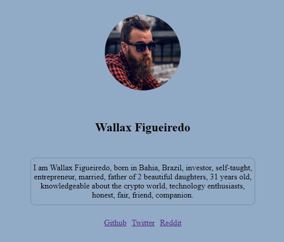

# Prática: Layout com CSS Flexbox

Nesta prática, a tarefa será recriar visualmente, na tela do navegador, o que
consta na imagem acima. Deverá ser usado CSS Flexbox nesta construção.

1 - Criar um arquivo index.html contendo o código e linkando suas redes sociais .

2 - Criar um arquivo styles.css para estilizar o FLEXBOX .
