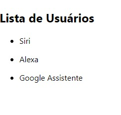

# Prática: Lista de Usuários

## Esta prática exemplifica como fazer uma listagem de usuários no React.js.

### 1 - Criamos uma nova aplicação React.js
### 2 - Criamos um componente responsável por exibir as informações sobre usúarios na aplicação (item).
### 3 - Criamos um componente responsável por listar os usuários como itens (list).
### 4 - exibir o componente list na página principal (o componente list deve receber a lista de usuários por meio desta página).
### 5 - Para verificar se a sua aplicação ReactJS está funcionando corretamente, você pode seguir os seguintes passos:

Inicie o servidor de desenvolvimento: No terminal, navegue até o diretório do seu projeto e execute o comando npm start ou yarn start, dependendo do gerenciador de pacotes que você está usando. Isso iniciará o servidor de desenvolvimento e recarregará a página sempre que você fizer alterações no código.

### 6 - Verifique se o ‘react-scripts’ está instalado: No seu terminal, navegue até a pasta do seu projeto e execute o comando npm ls react-scripts. Se ‘react-scripts’ estiver instalado, você verá a versão instalada. Se não estiver instalado, você pode instalá-lo com o comando npm install react-scripts.

### 7 - Se tudo estiver correto , pode executar o npm start e verá sua aplicação abrir uma página na WEB automaticamente .

